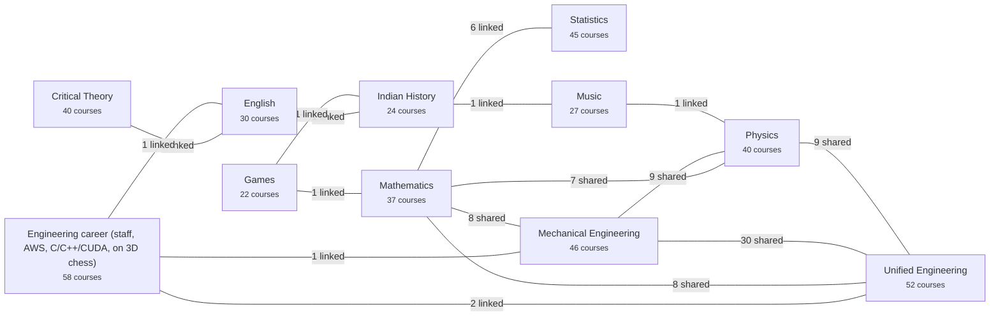

# The master graph: every major, one graph

Generated by `scripts/master_dag.py` from every `curriculum.json` and `cross-links.json`; don't edit by hand.

- **11 majors, 421 course entries, 374 distinct courses.** 30 courses are shared by id
  (the same course listed in several majors), and `cross-links.json` adds 20 links between courses whose ids differ:
  **same** (finishing either counts as both), **overlap** (shared material: the second goes faster), **feeds** (a real
  prerequisite across majors).
- Each major's own course-by-course graph is its `topics/<major>/DAG.md`. This page shows how the majors connect.

## How the majors connect

Edge label: shared courses + links.

## The bridge courses

Only the courses that tie majors together. Courses shared by id sit in the box of the first major that lists them, with
the other majors named; solid arrows are prerequisites inside a major, dotted lines are cross-links.

```mermaid
flowchart TB
  subgraph M_statistics["Statistics"]
    S201["S201 Probability theory"]
    S402["S402 ANOVA and regression"]
    S500["S500 Real analysis and measure refresher "]
    S501["S501 Measure-theoretic probability"]
  end
  subgraph M_eng["Engineering career (staff, AWS, C/C++/CUDA, on 3D chess)"]
    CP120["CP120 C and the machine"]
    CR326["CR326 Math toolkit: optimization and opera"]
    SE110["SE110 Writing: design docs, RFCs and decis"]
  end
  subgraph M_indian_history["Indian History"]
    IH320["IH320 Breadth: war and the state (links Ga"]
    IH340["IH340 Breadth: art, architecture and liter"]
  end
  subgraph M_games["Games"]
    G150["G150 Strategy foundations"]
    G401["G401 Decisions under chance (Pig, backgam"]
  end
  subgraph M_critical_theory["Critical Theory"]
    CT100["CT100 Orientation: what theory is (and rea"]
    CT201["CT201 New Criticism and formalism (close r"]
    CT211["CT211 Postcolonial criticism"]
    CT340["CT340 Elective: Indian fiction through the"]
    CT370["CT370 Elective: the long novels (Jane Eyre"]
  end
  subgraph M_math["Mathematics"]
    MA100["MA100 Precalculus: algebra, functions, tri<br/><small>also: Physics, Mechanical Engineering, Unified Engineering</small>"]
    MA140["MA140 Calculus I: limits, derivatives, int<br/><small>also: Physics, Mechanical Engineering, Unified Engineering</small>"]
    MA141["MA141 Calculus II: integration techniques,<br/><small>also: Physics, Mechanical Engineering, Unified Engineering</small>"]
    MA220["MA220 Matrices: computational linear algeb<br/><small>also: Physics, Mechanical Engineering, Unified Engineering</small>"]
    MA230["MA230 Calculus of several variables and ve<br/><small>also: Physics, Mechanical Engineering, Unified Engineering</small>"]
    MA250["MA250 Ordinary differential equations<br/><small>also: Physics, Mechanical Engineering, Unified Engineering</small>"]
    MA312["MA312 Real analysis I: the real line, sequ"]
    MA403["MA403 Real analysis II: metric spaces, uni"]
    MA412["MA412 Fourier series and partial different<br/><small>also: Physics, Mechanical Engineering, Unified Engineering</small>"]
    MA414["MA414 Probability<br/><small>also: Mechanical Engineering, Unified Engineering</small>"]
    MA511["MA511 Measure and integration"]
  end
  subgraph M_physics["Physics"]
    PH211["PH211 Mechanics (calculus-based)<br/><small>also: Mechanical Engineering, Unified Engineering</small>"]
    PH212["PH212 Electricity and magnetism (calculus-<br/><small>also: Mechanical Engineering, Unified Engineering</small>"]
    PH214["PH214 Waves, optics and the first quantum "]
  end
  subgraph M_mech_eng["Mechanical Engineering"]
    CH110["CH110 Chemical principles for engineers<br/><small>also: Unified Engineering</small>"]
    ES150["ES150 Engineering graphics and CAD (sketch<br/><small>also: Unified Engineering</small>"]
    ES160["ES160 Programming and numerical methods fo<br/><small>also: Unified Engineering</small>"]
    ES211["ES211 Statics<br/><small>also: Unified Engineering</small>"]
    ES212["ES212 Dynamics<br/><small>also: Unified Engineering</small>"]
    ES213["ES213 Mechanics of materials: stress, stra<br/><small>also: Unified Engineering</small>"]
    ES221["ES221 Thermodynamics<br/><small>also: Unified Engineering</small>"]
    ES231["ES231 Fluid mechanics<br/><small>also: Unified Engineering</small>"]
    ES240["ES240 Materials science and engineering<br/><small>also: Unified Engineering</small>"]
    ES250["ES250 Circuits and electronics for enginee<br/><small>also: Unified Engineering</small>"]
    ES340["ES340 System dynamics and feedback control<br/><small>also: Unified Engineering</small>"]
    ES370["ES370 Heat transfer<br/><small>also: Unified Engineering</small>"]
    ES380["ES380 Practice: measurement and instrument<br/><small>also: Unified Engineering</small>"]
    ME310["ME310 Kinematics and dynamics of machinery<br/><small>also: Unified Engineering</small>"]
    ME330["ME330 Mechanical vibrations<br/><small>also: Unified Engineering</small>"]
    ME350["ME350 Machine design (failure theories, fa<br/><small>also: Unified Engineering</small>"]
    ME360["ME360 Manufacturing processes (machining, <br/><small>also: Unified Engineering</small>"]
    ME385["ME385 Practice: shop work (woodworking and<br/><small>also: Unified Engineering</small>"]
    ME410["ME410 Finite element analysis<br/><small>also: Unified Engineering</small>"]
    ME430["ME430 Robotics<br/><small>also: Unified Engineering</small>"]
    ME561["ME561 Engineering design optimization"]
  end
  subgraph M_unified_eng["Unified Engineering"]
    UE335["UE335 Digital systems and computer organiz"]
    UE370["UE370 Industrial and systems engineering: "]
  end
  subgraph M_music["Music"]
    MU190["MU190 Breadth: the physics of sound and he"]
    MU240["MU240 Hindustani classical music and world"]
  end
  subgraph M_english["English"]
    EN230["EN230 The novel: Cervantes to Woolf"]
    EN300["EN300 Literary theory and criticism"]
    EN330["EN330 Postcolonial and Indian literature i"]
    EN342["EN342 Advanced nonfiction and technical wr"]
  end
  MA100 --> CH110
  CT100 --> CT201
  CT211 --> CT340
  MA100 --> ES150
  MA141 --> ES160
  MA220 --> ES160
  PH211 --> ES211
  MA141 --> ES211
  ES211 --> ES212
  MA230 --> ES212
  ES211 --> ES213
  MA250 --> ES213
  PH211 --> ES221
  CH110 --> ES221
  MA141 --> ES221
  ES212 --> ES231
  ES221 --> ES231
  MA230 --> ES231
  CH110 --> ES240
  PH211 --> ES240
  PH212 --> ES250
  MA250 --> ES250
  ES212 --> ES340
  ES250 --> ES340
  MA250 --> ES340
  ES221 --> ES370
  ES231 --> ES370
  ES250 --> ES380
  MA414 --> ES380
  MA100 --> MA140
  MA140 --> MA141
  MA100 --> MA220
  MA141 --> MA230
  MA220 --> MA230
  MA141 --> MA250
  MA220 --> MA250
  MA312 --> MA403
  MA230 --> MA403
  MA250 --> MA412
  MA230 --> MA412
  MA230 --> MA414
  MA403 --> MA511
  ES212 --> ME310
  ES150 --> ME310
  ES212 --> ME330
  MA250 --> ME330
  MA220 --> ME330
  ES213 --> ME350
  ES240 --> ME350
  ME310 --> ME350
  ES240 --> ME360
  ES150 --> ME360
  ES150 --> ME385
  ES213 --> ME410
  ES160 --> ME410
  ES212 --> ME430
  ES340 --> ME430
  MA220 --> ME430
  ES160 --> ME561
  ME350 --> ME561
  MA140 --> PH211
  PH211 --> PH212
  MA141 --> PH212
  PH212 --> PH214
  S500 --> S501
  ES250 --> UE335
  MA414 --> UE370
  MA220 --> UE370
  MA414 -. same .- S201
  EN300 -. same .- CT100
  EN300 -. overlap .- CT201
  MA403 -. overlap .- S500
  MA511 -. overlap .- S501
  EN330 -. overlap .- CT211
  EN330 -. overlap .- CT340
  EN230 -. overlap .- CT370
  EN330 -. overlap .- IH340
  MU240 -. overlap .- IH340
  IH320 -. overlap .- G150
  MU190 -. overlap .- PH214
  UE370 -. overlap .- CR326
  ME561 -. overlap .- CR326
  UE335 -. overlap .- CP120
  EN342 -. overlap .- SE110
  MA230 -. feeds .-> S201
  MA220 -. feeds .-> S402
  MA312 -. feeds .-> S500
  MA414 -. feeds .-> G401
```

## Shared courses (one course, several majors)

| Course | Title | Majors |
|---|---|---|
| CH110 | Chemical principles for engineers | Mechanical Engineering, Unified Engineering |
| ES150 | Engineering graphics and CAD (sketching, drawings, parametric and code CAD) | Mechanical Engineering, Unified Engineering |
| ES160 | Programming and numerical methods for engineers (Python) | Mechanical Engineering, Unified Engineering |
| ES211 | Statics | Mechanical Engineering, Unified Engineering |
| ES212 | Dynamics | Mechanical Engineering, Unified Engineering |
| ES213 | Mechanics of materials: stress, strain, axial, torsion, bending, buckling | Mechanical Engineering, Unified Engineering |
| ES221 | Thermodynamics | Mechanical Engineering, Unified Engineering |
| ES231 | Fluid mechanics | Mechanical Engineering, Unified Engineering |
| ES240 | Materials science and engineering | Mechanical Engineering, Unified Engineering |
| ES250 | Circuits and electronics for engineers | Mechanical Engineering, Unified Engineering |
| ES340 | System dynamics and feedback control | Mechanical Engineering, Unified Engineering |
| ES370 | Heat transfer | Mechanical Engineering, Unified Engineering |
| ES380 | Practice: measurement and instrumentation lab (Arduino, phone sensors) | Mechanical Engineering, Unified Engineering |
| MA100 | Precalculus: algebra, functions, trigonometry | Mathematics, Physics, Mechanical Engineering, Unified Engineering |
| MA140 | Calculus I: limits, derivatives, integrals | Mathematics, Physics, Mechanical Engineering, Unified Engineering |
| MA141 | Calculus II: integration techniques, sequences and series, parametric and polar | Mathematics, Physics, Mechanical Engineering, Unified Engineering |
| MA220 | Matrices: computational linear algebra | Mathematics, Physics, Mechanical Engineering, Unified Engineering |
| MA230 | Calculus of several variables and vector analysis | Mathematics, Physics, Mechanical Engineering, Unified Engineering |
| MA250 | Ordinary differential equations | Mathematics, Physics, Mechanical Engineering, Unified Engineering |
| MA412 | Fourier series and partial differential equations | Mathematics, Physics, Mechanical Engineering, Unified Engineering |
| MA414 | Probability | Mathematics, Mechanical Engineering, Unified Engineering |
| ME310 | Kinematics and dynamics of machinery (linkages, cams, gears) | Mechanical Engineering, Unified Engineering |
| ME330 | Mechanical vibrations | Mechanical Engineering, Unified Engineering |
| ME350 | Machine design (failure theories, fatigue, shafts, bearings, fasteners) | Mechanical Engineering, Unified Engineering |
| ME360 | Manufacturing processes (machining, casting, forming, additive) | Mechanical Engineering, Unified Engineering |
| ME385 | Practice: shop work (woodworking and machining as engineering) | Mechanical Engineering, Unified Engineering |
| ME410 | Finite element analysis | Mechanical Engineering, Unified Engineering |
| ME430 | Robotics | Mechanical Engineering, Unified Engineering |
| PH211 | Mechanics (calculus-based) | Physics, Mechanical Engineering, Unified Engineering |
| PH212 | Electricity and magnetism (calculus-based) | Physics, Mechanical Engineering, Unified Engineering |

## Cross-links (different ids)

| A | B | Kind | Why |
|---|---|---|---|
| MA414 Probability | S201 Probability theory | same | both are first-course probability; S201 is Casella & Berger ch. 1, MA414 Bertsekas & Tsitsiklis |
| EN300 Literary theory and criticism | CT100 Orientation: what theory is (and read Ga | same | both open literary theory with Culler's Literary Theory VSI |
| EN300 Literary theory and criticism | CT201 New Criticism and formalism (close readi | overlap | close reading / New Criticism |
| MA403 Real analysis II: metric spaces, uniform | S500 Real analysis and measure refresher (pre | overlap | S500 is a real-analysis refresher |
| MA511 Measure and integration | S501 Measure-theoretic probability | overlap | measure theory under both |
| EN330 Postcolonial and Indian literature in En | CT211 Postcolonial criticism | overlap | postcolonial literature and the postcolonial lens |
| EN330 Postcolonial and Indian literature in En | CT340 Elective: Indian fiction through the len | overlap | Indian fiction (Midnight's Children) |
| EN230 The novel: Cervantes to Woolf | CT370 Elective: the long novels (Jane Eyre, Mi | overlap | the long novels (Middlemarch) |
| EN330 Postcolonial and Indian literature in En | IH340 Breadth: art, architecture and literatur | overlap | Indian literature |
| MU240 Hindustani classical music and world mus | IH340 Breadth: art, architecture and literatur | overlap | Hindustani music in the arts of India |
| IH320 Breadth: war and the state (links Games  | G150 Strategy foundations | overlap | war and the state / strategy foundations |
| MU190 Breadth: the physics of sound and hearin | PH214 Waves, optics and the first quantum idea | overlap | waves and sound |
| UE370 Industrial and systems engineering: oper | CR326 Math toolkit: optimization and operation | overlap | operations research |
| ME561 Engineering design optimization | CR326 Math toolkit: optimization and operation | overlap | optimization |
| UE335 Digital systems and computer organizatio | CP120 C and the machine | overlap | how the machine runs code |
| EN342 Advanced nonfiction and technical writin | SE110 Writing: design docs, RFCs and decision  | overlap | technical and design-doc writing |
| MA230 Calculus of several variables and vector | S201 Probability theory | feeds | joint distributions need multivariable calculus |
| MA220 Matrices: computational linear algebra | S402 ANOVA and regression | feeds | regression in matrix form |
| MA312 Real analysis I: the real line, sequence | S500 Real analysis and measure refresher (pre | feeds | first analysis course before the refresher |
| MA414 Probability | G401 Decisions under chance (Pig, backgammon  | feeds | probability for decisions under chance |

## Not yet connected

Every major has at least one connection.
Add links in `cross-links.json` when two courses share real material; the tests check that both ends exist.
