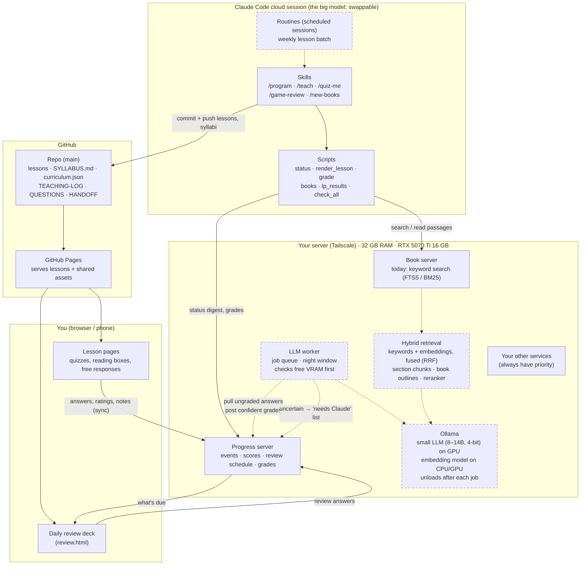
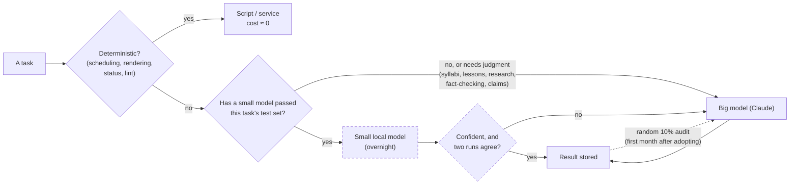
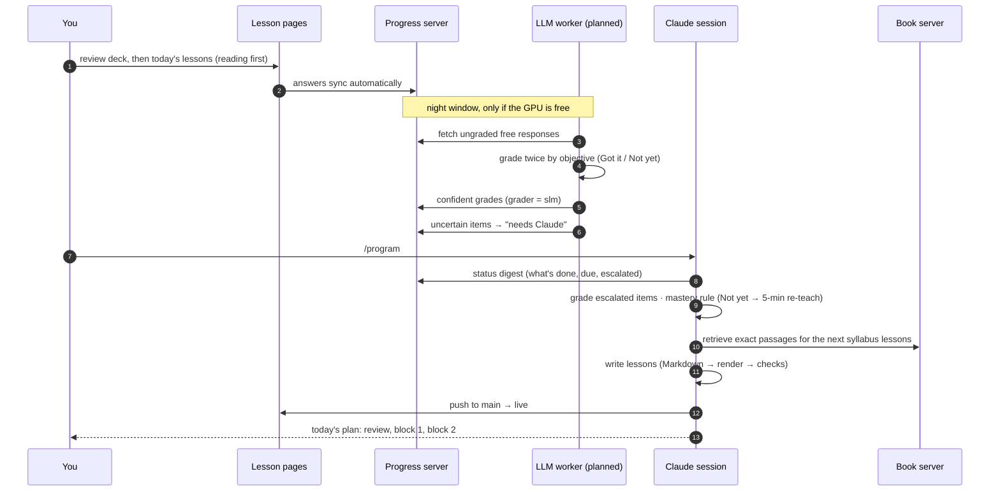

# The learning platform: fully realized system (as planned 2026-10-06)

Solid boxes exist today. **Dashed boxes are planned** (`notes/slm-offload-plan.md`). Rule throughout: every task goes to the
cheapest component that has passed that task's quality bar; anything uncertain escalates to the big model.

## 1. Architecture

## 2. Who does what (the cascade)

## 3. A day in the loop

## Quality gates (from the plan)
| Task | Test set | Bar to adopt |
|---|---|---|
| Book search | questions whose passages Claude already found | right passage in top 3, ≥ 90% |
| Grading | answers Claude already graded | ≥ 90% agreement on Got it / Not yet, per subject |
| Question drafts | — | lint + Claude spot-check before publishing |
