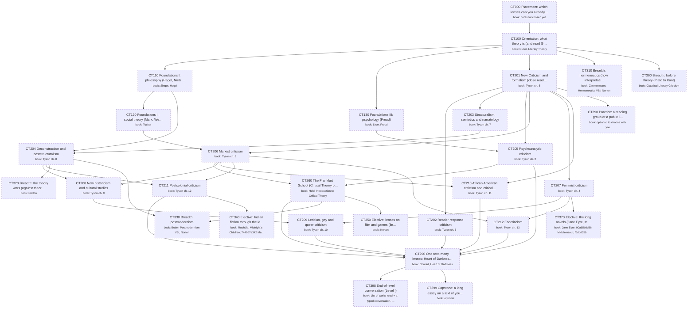

# Critical Theory: the major as a DAG of books

Generated by `scripts/major_dag.py` from `curriculum.json`; don't edit by hand. Each box is a course: a block of its
primary book ("book: …" lines). Arrows point from a prerequisite to the course that needs it. Bold = active,
grey = done, dashed = later or optional. Level II courses appear only once you enroll.

