# Engineering career (staff, AWS, C/C++/CUDA, on 3D chess): the major as a DAG of books

Generated by `scripts/major_dag.py` from `curriculum.json`; don't edit by hand. Each box is a course: a block of its
primary book ("book: …" lines). Arrows point from a prerequisite to the course that needs it. Bold = active,
grey = done, dashed = later or optional. Level II courses appear only once you enroll.

```mermaid
flowchart TB
  VI100["VI100 Vim, every day<br/><small>book: Neil, Practical Vim 2nd ed.</small>"]
  SE000["SE000 Placement: where you are against a staf…<br/><small>book: Public staff rubrics</small>"]
  SE101["SE101 What staff is, and how people get there<br/><small>book: Reilly, The Staff Engineer's Path</small>"]
  SE110["SE110 Writing: design docs, RFCs and decision…<br/><small>book: Winters, Manshreck & Wright</small>"]
  SE120["SE120 System and ML system design at depth<br/><small>book: Kleppmann, Designing Data-Intensive Applica…</small>"]
  SE130["SE130 Software design: complexity, modules an…<br/><small>book: Ousterhout, A Philosophy of Software Design…</small>"]
  SE140["SE140 Execution: leading cross-team work with…<br/><small>book: Reilly, The Staff Engineer's Path</small>"]
  SE150["SE150 Technical strategy and direction<br/><small>book: Larson, An Elegant Puzzle</small>"]
  SE160["SE160 Evidence and leveling: promo packet or …<br/><small>book: Larson, Staff Engineer</small>"]
  SE170["SE170 Mentoring and raising the bar<br/><small>book: book not chosen yet</small>"]
  SE390["SE390 Practice: one staff-scope project, writ…<br/><small>book: book not chosen yet</small>"]
  SE399["SE399 Capstone: the staff title (promotion or…<br/><small>book: book not chosen yet</small>"]
  AW000["AW000 AWS placement and exam date<br/><small>book: AWS MLA-C02 exam guide</small>"]
  AW101["AW101 AWS foundations through the RL training…<br/><small>book: Your 2024 AWS Solutions Architect Associate…</small>"]
  AW201["AW201 ML on AWS (MLA-C02 domains)<br/><small>book: AWS Certified Machine Learning Engineer - A…</small>"]
  AW290["AW290 MLA-C02 exam<br/><small>book: book not chosen yet</small>"]
  CP000["CP000 Placement<br/><small>book: book not chosen yet</small>"]
  CP101["CP101 C, properly<br/><small>book: Gustedt, Modern C</small>"]
  CP120["CP120 C and the machine<br/><small>book: Bryant & O'Hallaron, Computer Systems</small>"]
  CP201["CP201 Core C++<br/><small>book: Lippman, Lajoie & Moo</small>"]
  CP202["CP202 Effective modern C++<br/><small>book: Meyers, Effective Modern C++</small>"]
  CP203["CP203 Generic programming and the standard li…<br/><small>book: Josuttis, The C++ Standard Library 2nd ed.</small>"]
  CP204["CP204 Concurrency<br/><small>book: Williams, C++ Concurrency in Action 2nd ed.</small>"]
  CP310["CP310 Linux systems programming<br/><small>book: Kerrisk, The Linux Programming Interface</small>"]
  CP320["CP320 GPU programming with CUDA<br/><small>book: Hwu, Kirk & El Hajj</small>"]
  CP330["CP330 Game engine programming<br/><small>book: Gregory, Game Engine Architecture 3rd ed.</small>"]
  CR100["CR100 ML systems design and MLOps<br/><small>book: Huyen, Designing Machine Learning Systems</small>"]
  CR110["CR110 Kubernetes for ML (CKAD)<br/><small>book: CNCF CKAD curriculum</small>"]
  CR120["CR120 LLM applications and agents<br/><small>book: Huyen, AI Engineering</small>"]
  CR130["CR130 Fine-tuning and post-training LLMs at s…<br/><small>book: NVIDIA NCP-GENL exam guide and study path</small>"]
  CR140["CR140 Inference optimization and serving<br/><small>book: vLLM docs</small>"]
  CR170["CR170 Data engineering with Spark<br/><small>book: book not chosen yet</small>"]
  CR210["CR210 Google Professional ML Engineer<br/><small>book: book not chosen yet</small>"]
  CR220["CR220 Azure AI Apps and Agents Developer (AI-…<br/><small>book: book not chosen yet</small>"]
  CR230["CR230 Databricks Generative AI Engineer Assoc…<br/><small>book: book not chosen yet</small>"]
  CR240["CR240 Terraform Associate (004)<br/><small>book: book not chosen yet</small>"]
  CR250["CR250 AWS Generative AI Developer – Professio…<br/><small>book: book not chosen yet</small>"]
  CR310["CR310 Safety net (on hold): quant developer<br/><small>book: book not chosen yet</small>"]
  CR320["CR320 Safety net (on hold): quant research<br/><small>book: book not chosen yet</small>"]
  CR325["CR325 Safety net: actuary (SOA exams)<br/><small>book: book not chosen yet</small>"]
  CR326["CR326 Math toolkit: optimization and operatio…<br/><small>book: book not chosen yet</small>"]
  CR327["CR327 Safety net: patent agent (USPTO registr…<br/><small>book: book not chosen yet</small>"]
  CR330["CR330 AI and cloud security<br/><small>book: book not chosen yet</small>"]
  CR340["CR340 Fallback: cloud / AI solutions architect<br/><small>book: book not chosen yet</small>"]
  CR350["CR350 Language: Rust<br/><small>book: book not chosen yet</small>"]
  CR360["CR360 Language: Go<br/><small>book: book not chosen yet</small>"]
  CR370["CR370 Track: embedded and robotics software<br/><small>book: book not chosen yet</small>"]
  CR380["CR380 Platform engineering and SRE (CKA)<br/><small>book: Beyer et al., Site Reliability Engineering</small>"]
  SE000 --> SE101
  SE000 --> SE110
  SE000 --> SE120
  SE000 --> SE130
  SE101 --> SE140
  SE110 --> SE150
  SE140 --> SE150
  SE120 --> SE160
  SE150 --> SE160
  SE101 --> SE170
  SE140 --> SE390
  SE160 --> SE399
  AW000 --> AW101
  AW101 --> AW201
  AW201 --> AW290
  CP000 --> CP101
  CP101 --> CP120
  CP101 --> CP201
  CP201 --> CP202
  CP201 --> CP203
  CP202 --> CP204
  CP120 --> CP204
  CP120 --> CP310
  CP101 --> CP320
  CP202 --> CP330
  SE000 --> CR100
  CR100 --> CR110
  CR100 --> CR120
  CR100 --> CR130
  CR110 --> CR140
  CR130 --> CR140
  CR100 --> CR170
  CR100 --> CR210
  CR120 --> CR220
  CR120 --> CR230
  SE000 --> CR240
  CR120 --> CR250
  SE000 --> CR310
  SE000 --> CR320
  SE000 --> CR325
  SE000 --> CR326
  SE000 --> CR327
  CR110 --> CR330
  SE000 --> CR340
  SE000 --> CR350
  SE000 --> CR360
  SE000 --> CR370
  CR110 --> CR380
  classDef done fill:#eee,color:#777,stroke:#bbb
  classDef active stroke-width:3px
  classDef later stroke-dasharray:5 4
  class VI100 later
  class SE000 active
  class SE101 later
  class SE110 later
  class SE120 later
  class SE130 later
  class SE140 later
  class SE150 later
  class SE160 later
  class SE170 later
  class SE390 later
  class SE399 later
  class AW000 active
  class AW101 later
  class AW201 later
  class AW290 later
  class CP000 later
  class CP101 later
  class CP120 later
  class CP201 later
  class CP202 later
  class CP203 later
  class CP204 later
  class CP310 later
  class CP320 later
  class CP330 later
  class CR100 later
  class CR110 later
  class CR120 later
  class CR130 later
  class CR140 later
  class CR170 later
  class CR210 later
  class CR220 later
  class CR230 later
  class CR240 later
  class CR250 later
  class CR310 later
  class CR320 later
  class CR325 later
  class CR326 later
  class CR327 later
  class CR330 later
  class CR340 later
  class CR350 later
  class CR360 later
  class CR370 later
  class CR380 later
```

## Active courses: books by role

**SE000 Placement: where you are against a staff rubric**
- primary: Public staff rubrics: Larson's archetypes (staffeng.com) + a public engineering career framework; your own work as the evidence
- secondary: Reilly, The Staff Engineer's Path, Ch. 1 (owned)

**AW000 AWS placement and exam date**
- primary: AWS MLA-C02 exam guide (domains and task statements)
- secondary: Your 2024 AWS Solutions Architect Associate course (learner-supplied)
