# English: the major as a DAG of books

Generated by `scripts/major_dag.py` from `curriculum.json`; don't edit by hand. Each box is a course: a block of its
primary book ("book: …" lines). Arrows point from a prerequisite to the course that needs it. Bold = active,
grey = done, dashed = later or optional. Level II courses appear only once you enroll.

```mermaid
flowchart TB
  EN015["EN015 Rhetoric and composition: the academic …<br/><small>book: Zinsser, On Writing Well</small>"]
  EN100["EN100 How to read literature: an introduction…<br/><small>book: Foster, How to Read Literature Like a Profe…</small>"]
  EN130["EN130 Poetry: form, meter and close reading<br/><small>book: Ferguson, Salter & Stallworthy</small>"]
  EN201["EN201 British literature I: Beowulf to the Re…<br/><small>book: Greenblatt</small>"]
  EN202["EN202 British literature II: the Romantics to…<br/><small>book: Greenblatt</small>"]
  EN211["EN211 American literature I: beginnings to 18…<br/><small>book: Levine</small>"]
  EN212["EN212 American literature II: 1865 to the pre…<br/><small>book: Levine</small>"]
  EN220["EN220 Shakespeare: eight plays and the sonnets<br/><small>book: The Complete Works of William Shakespeare</small>"]
  EN230["EN230 The novel: Cervantes to Woolf<br/><small>book: Austen, Complete Works</small>"]
  EN300["EN300 Literary theory and criticism<br/><small>book: Culler, Literary Theory VSI + face941c2e No…</small>"]
  EN310["EN310 The English language: its history and h…<br/><small>book: Horobin, The English Language VSI</small>"]
  EN320["EN320 World literature in translation: Homer …<br/><small>book: Homer, The Odyssey</small>"]
  EN330["EN330 Postcolonial and Indian literature in E…<br/><small>book: Rushdie, Midnight's Children</small>"]
  EN400["EN400 Senior seminar: one author in depth (de…<br/><small>book: Joyce, Ulysses</small>"]
  EN340["EN340 Creative writing: fiction<br/><small>book: King, On Writing</small>"]
  EN341["EN341 Dramatic writing and screenwriting<br/><small>book: Egri, The Art of Dramatic Writing</small>"]
  EN342["EN342 Advanced nonfiction and technical writi…<br/><small>book: Zinsser, Writing to Learn</small>"]
  EN350["EN350 The Russian novel<br/><small>book: Dostoevsky, The Brothers Karamazov</small>"]
  EN360["EN360 Classical literature: Greek tragedy, Ov…<br/><small>book: Allan, Classical Literature VSI</small>"]
  EN370["EN370 Dystopian fiction<br/><small>book: Orwell, 1984</small>"]
  EN190["EN190 Breadth: writing systems and the book<br/><small>book: Robinson, Writing and Script VSI</small>"]
  EN398["EN398 End-of-level conversation (Level I)<br/><small>book: list of works + conversation</small>"]
  EN399["EN399 Capstone: a 20-page critical essay (hon…<br/><small>book: optional; topic with you</small>"]
  EN100 --> EN130
  EN100 --> EN201
  EN100 --> EN202
  EN100 --> EN211
  EN100 --> EN212
  EN100 --> EN220
  EN100 --> EN230
  EN130 --> EN300
  EN100 --> EN310
  EN100 --> EN320
  EN100 --> EN330
  EN202 --> EN400
  EN300 --> EN400
  EN015 --> EN340
  EN015 --> EN341
  EN015 --> EN342
  EN230 --> EN350
  EN100 --> EN360
  EN100 --> EN370
  EN400 --> EN398
  EN400 --> EN399
  classDef done fill:#eee,color:#777,stroke:#bbb
  classDef active stroke-width:3px
  classDef later stroke-dasharray:5 4
  classDef credited fill:#e8e8e8,color:#999,stroke:#ccc
  classDef maybe fill:#f4f4f4,color:#666,stroke:#aaa,stroke-dasharray:2 2
  classDef start stroke-width:4px,stroke:#000
  class EN015 credited
  class EN100 start
  class EN130 later
  class EN201 later
  class EN202 later
  class EN211 later
  class EN212 later
  class EN220 later
  class EN230 later
  class EN300 later
  class EN310 later
  class EN320 later
  class EN330 later
  class EN400 later
  class EN340 later
  class EN341 later
  class EN342 later
  class EN350 later
  class EN360 later
  class EN370 later
  class EN190 later
  class EN398 later
  class EN399 later
```

## Where you enter

Written as if starting from high school (EN015, EN100 first). Your entry point:
- **Credited** (pale grey, from your degrees): EN015
- **Maybe** (dotted: skim or skip, your call): none
- **Start here** (thick border): EN100
- Basis: Both Penn State degrees required first-year composition (ENGL 15) and the CompE degree ENGL 202C (technical writing), so EN015 is credited. No college literature courses. AP Literature in high school (no exam) gives no credit, but it covers much of EN100 and some of EN130, so expect both to go quickly.
