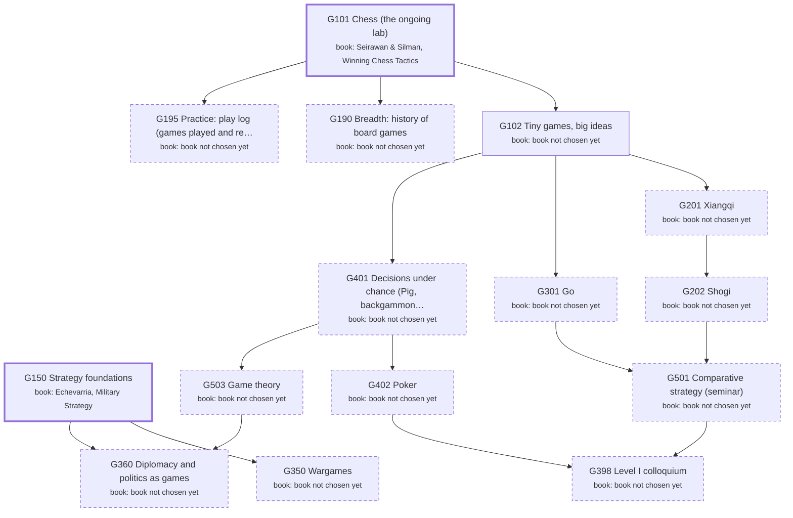

# Games: the major as a DAG of books

Generated by `scripts/major_dag.py` from `curriculum.json`; don't edit by hand. Each box is a course: a block of its
primary book ("book: …" lines). Arrows point from a prerequisite to the course that needs it. Bold = active,
grey = done, dashed = later or optional. Level II courses appear only once you enroll.

## Active courses: books by role

**G101 Chess (the ongoing lab)**
- primary: 50634c974d Seirawan & Silman, Winning Chess Tactics (chapter per lesson)
- secondary: b7c9d62e2b Seirawan, Winning Chess Endings (king-and-pawn lesson)
- secondary: your own games, reviewed with Stockfish (/game-review)
- tertiary: d2e32f3e7e Capablanca, Chess Fundamentals
- skip: 725d5b0db7 Nimzowitsch, My System: positional, for a later strategy course
- skip: aff99a5c4f Silman, Complete Book of Chess Strategy: grade B; later

**G150 Strategy foundations**
- primary: 940de01b70 Echevarria, Military Strategy: A Very Short Introduction
- secondary: 8cb37bf97d Clausewitz, On War (Bk 1 Ch. 1)
- secondary: 3329556537 Sun Tzu, The Art of War (Giles)
- secondary: a1de43a246 Polybius, The Rise of the Roman Empire (Punic Wars cases)
- tertiary: c589beef4b Howard, Clausewitz (VSI)
- tertiary: e47c5dab8b Freedman, Strategy: A History
- skip: 5727374d00 Gray, Modern Strategy: theory depth for G350, not foundations
