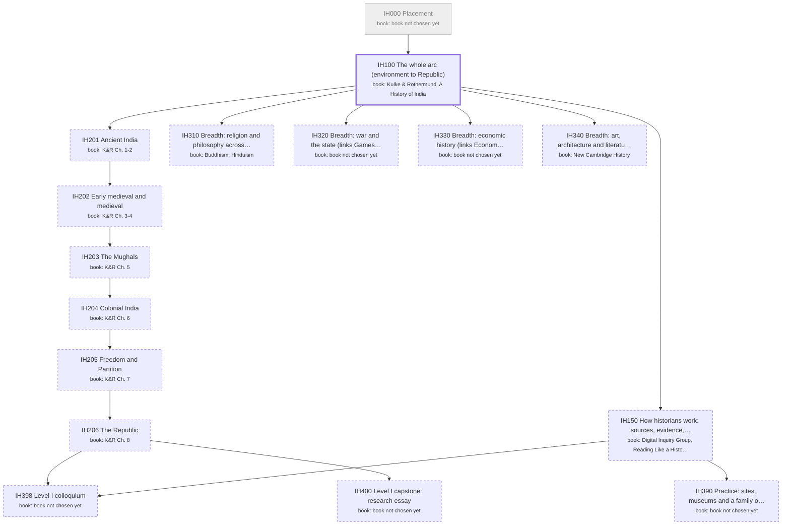

# Indian History: the major as a DAG of books

Generated by `scripts/major_dag.py` from `curriculum.json`; don't edit by hand. Each box is a course: a block of its
primary book ("book: …" lines). Arrows point from a prerequisite to the course that needs it. Bold = active,
grey = done, dashed = later or optional. Level II courses appear only once you enroll.

## Active courses: books by role

**IH100 The whole arc (environment to Republic)**
- primary: 621b57ff65 Kulke & Rothermund, A History of India: one key section per chapter (SYLLABUS.md)
- secondary: primary sources quoted in K&R (Rigveda, Ashokan edicts, Alberuni, Baburnama, Gandhi 1922, Nehru 1947)
- tertiary: published papers and reporting for the 'judge a public claim' boxes (cited per lesson)
- tertiary: Wikipedia infoboxes for map coordinates
- skip: New Cambridge History volumes: era depth belongs to IH201-206
