# Mathematics: the major as a DAG of books

Generated by `scripts/major_dag.py` from `curriculum.json`; don't edit by hand. Each box is a course: a block of its
primary book ("book: …" lines). Arrows point from a prerequisite to the course that needs it. Bold = active,
grey = done, dashed = later or optional. Level II courses appear only once you enroll.

```mermaid
flowchart TB
  MA100["MA100 Precalculus: algebra, functions, trigon…<br/><small>book: OpenStax, Precalculus 2e</small>"]
  MA140["MA140 Calculus I: limits, derivatives, integr…<br/><small>book: OpenStax, Calculus Volume 1</small>"]
  MA141["MA141 Calculus II: integration techniques, se…<br/><small>book: OpenStax, Calculus Volume 2</small>"]
  MA220["MA220 Matrices: computational linear algebra<br/><small>book: Strang, Introduction to Linear Algebra</small>"]
  MA230["MA230 Calculus of several variables and vecto…<br/><small>book: OpenStax, Calculus Volume 3</small>"]
  MA250["MA250 Ordinary differential equations<br/><small>book: Zill, Differential Equations with Boundary-…</small>"]
  MA311["MA311 Proofs: logic, sets, induction, relatio…<br/><small>book: Velleman, How to Prove It</small>"]
  MA312["MA312 Real analysis I: the real line, sequenc…<br/><small>book: Abbott, Understanding Analysis</small>"]
  MA403["MA403 Real analysis II: metric spaces, unifor…<br/><small>book: Rudin, Principles of Mathematical Analysis</small>"]
  MA414["MA414 Probability<br/><small>book: Bertsekas & Tsitsiklis, Introduction to Pro…</small>"]
  MA435["MA435 Abstract algebra I: groups and symmetry<br/><small>book: Artin, Algebra 1st ed.</small>"]
  MA436["MA436 Linear algebra done abstractly: vector …<br/><small>book: Axler, Linear Algebra Done Right</small>"]
  MA437["MA437 Abstract algebra II: rings, factorizati…<br/><small>book: Artin, Algebra</small>"]
  MA421["MA421 Complex analysis<br/><small>book: Bak & Newman, Complex Analysis 3rd</small>"]
  MA429["MA429 Topology: metric and topological spaces<br/><small>book: Sutherland, Introduction to Metric and Topo…</small>"]
  MA412["MA412 Fourier series and partial differential…<br/><small>book: Strauss, Partial Differential Equations</small>"]
  MA455["MA455 Numerical analysis<br/><small>book: Burden & Faires, Numerical Analysis</small>"]
  MA360["MA360 Concrete and discrete mathematics: sums…<br/><small>book: Graham, Knuth & Patashnik</small>"]
  MA465["MA465 Number theory<br/><small>book: Silverman, A Friendly Introduction to Numbe…</small>"]
  MA417["MA417 Dynamical systems and chaos<br/><small>book: Strogatz, Nonlinear Dynamics and Chaos 2nd</small>"]
  MA470["MA470 Geometry: Euclid and beyond<br/><small>book: Euclid, Elements</small>"]
  MA480["MA480 Differential forms and calculus on mani…<br/><small>book: Bachman, A Visual Introduction to Different…</small>"]
  MA457["MA457 Mathematical logic<br/><small>book: Enderton, A Mathematical Introduction to Lo…</small>"]
  MA190["MA190 Breadth: what mathematics is, and its h…<br/><small>book: Stedall, The History of Mathematics VSI</small>"]
  MA390["MA390 Practice: problem solving (Putnam-style)<br/><small>book: Zeitz, The Art and Craft of Problem Solving…</small>"]
  MA398["MA398 End-of-level conversation (Level I)<br/><small>book: list of works read + a typed conversation</small>"]
  MA399["MA399 Capstone: an expository paper on a topi…<br/><small>book: optional; to choose with you</small>"]
  MA100 --> MA140
  MA140 --> MA141
  MA100 --> MA220
  MA141 --> MA230
  MA220 --> MA230
  MA141 --> MA250
  MA220 --> MA250
  MA141 --> MA311
  MA311 --> MA312
  MA312 --> MA403
  MA230 --> MA403
  MA230 --> MA414
  MA311 --> MA435
  MA220 --> MA435
  MA311 --> MA436
  MA220 --> MA436
  MA435 --> MA437
  MA312 --> MA421
  MA230 --> MA421
  MA312 --> MA429
  MA250 --> MA412
  MA230 --> MA412
  MA250 --> MA455
  MA220 --> MA455
  MA311 --> MA360
  MA311 --> MA465
  MA250 --> MA417
  MA220 --> MA417
  MA311 --> MA470
  MA230 --> MA480
  MA436 --> MA480
  MA311 --> MA457
  MA311 --> MA390
  MA403 --> MA398
  MA437 --> MA398
  MA403 --> MA399
  MA437 --> MA399
  classDef done fill:#eee,color:#777,stroke:#bbb
  classDef active stroke-width:3px
  classDef later stroke-dasharray:5 4
  classDef credited fill:#e8e8e8,color:#999,stroke:#ccc
  classDef maybe fill:#f4f4f4,color:#666,stroke:#aaa,stroke-dasharray:2 2
  classDef start stroke-width:4px,stroke:#000
  class MA100 credited
  class MA140 credited
  class MA141 credited
  class MA220 credited
  class MA230 credited
  class MA250 credited
  class MA311 credited
  class MA312 credited
  class MA403 maybe
  class MA414 credited
  class MA435 maybe
  class MA436 maybe
  class MA437 start
  class MA421 credited
  class MA429 start
  class MA412 maybe
  class MA455 maybe
  class MA360 later
  class MA465 later
  class MA417 later
  class MA470 later
  class MA480 later
  class MA457 later
  class MA190 later
  class MA390 later
  class MA398 later
  class MA399 later
```

## Where you enter

Written as if starting from high school (MA100 first). Your entry point:
- **Credited** (pale grey, from your degrees): MA100, MA140, MA141, MA220, MA230, MA250, MA311, MA312, MA414, MA421
- **Maybe** (dotted: skim or skip, your call): MA403, MA412, MA435, MA436, MA455
- **Start here** (thick border): MA437, MA429
- Basis: Penn State BS Mathematics common core (MATH 140, 141, 220, 230, 250/251, 311W, 312, 414, 415). The option you took decides the 'maybe' row: General adds MATH 403 and one of 435/436; Graduate Study adds 403, 404, 421, 429, 435, 436; Applied adds 403, 412, 436, 455. Course ids here follow Penn State numbers on purpose. You took complex analysis (MATH 421), so MA421 is credited.
