# Mechanical Engineering: the major as a DAG of books

Generated by `scripts/major_dag.py` from `curriculum.json`; don't edit by hand. Each box is a course: a block of its
primary book ("book: …" lines). Arrows point from a prerequisite to the course that needs it. Bold = active,
grey = done, dashed = later or optional. Level II courses appear only once you enroll.

```mermaid
flowchart TB
  MA100["MA100 Precalculus: algebra, functions, trigon…<br/><small>book: OpenStax, Precalculus 2e</small>"]
  MA140["MA140 Calculus I: limits, derivatives, integr…<br/><small>book: OpenStax, Calculus Volume 1</small>"]
  MA141["MA141 Calculus II: integration techniques, se…<br/><small>book: OpenStax, Calculus Volume 2</small>"]
  MA220["MA220 Matrices: computational linear algebra<br/><small>book: Strang, Introduction to Linear Algebra</small>"]
  MA230["MA230 Calculus of several variables and vecto…<br/><small>book: OpenStax, Calculus Volume 3</small>"]
  MA250["MA250 Ordinary differential equations<br/><small>book: Zill, Differential Equations with Boundary-…</small>"]
  MA414["MA414 Probability<br/><small>book: Bertsekas & Tsitsiklis, Introduction to Pro…</small>"]
  PH211["PH211 Mechanics (calculus-based)<br/><small>book: OpenStax, University Physics Volume 1</small>"]
  PH212["PH212 Electricity and magnetism (calculus-bas…<br/><small>book: OpenStax, University Physics Volume 2</small>"]
  CH110["CH110 Chemical principles for engineers<br/><small>book: OpenStax, Chemistry 2e</small>"]
  ES150["ES150 Engineering graphics and CAD (sketching…<br/><small>book: Gohde & Kintel, Programming with OpenSCAD</small>"]
  ES160["ES160 Programming and numerical methods for e…<br/><small>book: Hoffman, Numerical Methods for Engineers an…</small>"]
  ES211["ES211 Statics<br/><small>book: Baker & Haynes, Engineering Statics</small>"]
  ES212["ES212 Dynamics<br/><small>book: Hibbeler, Engineering Mechanics</small>"]
  ES213["ES213 Mechanics of materials: stress, strain,…<br/><small>book: Hibbeler, Mechanics of Materials 10th</small>"]
  ES221["ES221 Thermodynamics<br/><small>book: Cengel, Introduction to Thermodynamics and …</small>"]
  ES231["ES231 Fluid mechanics<br/><small>book: Cengel & Cimbala, Fluid Mechanics</small>"]
  ES240["ES240 Materials science and engineering<br/><small>book: Callister & Rethwisch, Materials Science an…</small>"]
  ES250["ES250 Circuits and electronics for engineers<br/><small>book: Kuphaldt, Lessons in Electric Circuits vols…</small>"]
  ES340["ES340 System dynamics and feedback control<br/><small>book: Astrom & Murray, Feedback Systems 2nd</small>"]
  ES370["ES370 Heat transfer<br/><small>book: Cengel, Introduction to Thermodynamics and …</small>"]
  ME310["ME310 Kinematics and dynamics of machinery (l…<br/><small>book: Norton, Design of Machinery</small>"]
  ME330["ME330 Mechanical vibrations<br/><small>book: Rao, Mechanical Vibrations</small>"]
  ME350["ME350 Machine design (failure theories, fatig…<br/><small>book: Budynas & Nisbett, Shigley's Mechanical Eng…</small>"]
  ME360["ME360 Manufacturing processes (machining, cas…<br/><small>book: Kalpakjian & Schmid, Manufacturing Engineer…</small>"]
  ME370["ME370 Applied thermodynamics and energy syste…<br/><small>book: Cengel & Boles, Thermodynamics</small>"]
  MA412["MA412 Fourier series and partial differential…<br/><small>book: Strauss, Partial Differential Equations</small>"]
  ME410["ME410 Finite element analysis<br/><small>book: Logan, A First Course in the Finite Element…</small>"]
  ME420["ME420 Computational fluid dynamics<br/><small>book: Lohner, Applied Computational Fluid Dynamic…</small>"]
  ME430["ME430 Robotics<br/><small>book: Lynch & Park, Modern Robotics</small>"]
  ME440["ME440 Biomechanics<br/><small>book: Knudson, Fundamentals of Biomechanics 2nd</small>"]
  ME190["ME190 Breadth: what engineers do and how thin…<br/><small>book: Blockley, Engineering VSI</small>"]
  ES380["ES380 Practice: measurement and instrumentati…<br/><small>book: Horowitz & Hill</small>"]
  ME385["ME385 Practice: shop work (woodworking and ma…<br/><small>book: Wearing, The Essential Woodworker</small>"]
  ME390["ME390 Practice: FE Mechanical exam self-check<br/><small>book: Lindeburg, FE Mechanical Practice Problems</small>"]
  ME398["ME398 End-of-level conversation (Level I)<br/><small>book: list of works + conversation</small>"]
  ME399["ME399 Capstone: design and build a mechanism<br/><small>book: optional; to choose with you</small>"]
  MA100 --> MA140
  MA140 --> MA141
  MA100 --> MA220
  MA141 --> MA230
  MA220 --> MA230
  MA141 --> MA250
  MA220 --> MA250
  MA230 --> MA414
  MA140 --> PH211
  PH211 --> PH212
  MA141 --> PH212
  MA100 --> CH110
  MA100 --> ES150
  MA141 --> ES160
  MA220 --> ES160
  PH211 --> ES211
  MA141 --> ES211
  ES211 --> ES212
  MA230 --> ES212
  ES211 --> ES213
  MA250 --> ES213
  PH211 --> ES221
  CH110 --> ES221
  MA141 --> ES221
  ES212 --> ES231
  ES221 --> ES231
  MA230 --> ES231
  CH110 --> ES240
  PH211 --> ES240
  PH212 --> ES250
  MA250 --> ES250
  ES212 --> ES340
  ES250 --> ES340
  MA250 --> ES340
  ES221 --> ES370
  ES231 --> ES370
  ES212 --> ME310
  ES150 --> ME310
  ES212 --> ME330
  MA250 --> ME330
  MA220 --> ME330
  ES213 --> ME350
  ES240 --> ME350
  ME310 --> ME350
  ES240 --> ME360
  ES150 --> ME360
  ES221 --> ME370
  ES231 --> ME370
  MA250 --> MA412
  MA230 --> MA412
  ES213 --> ME410
  ES160 --> ME410
  ES231 --> ME420
  ES160 --> ME420
  MA412 --> ME420
  ES212 --> ME430
  ES340 --> ME430
  MA220 --> ME430
  ES212 --> ME440
  ES213 --> ME440
  ES250 --> ES380
  MA414 --> ES380
  ES150 --> ME385
  ES213 --> ME390
  ES231 --> ME390
  ES340 --> ME390
  ME350 --> ME398
  ES370 --> ME398
  ME350 --> ME399
  classDef done fill:#eee,color:#777,stroke:#bbb
  classDef active stroke-width:3px
  classDef later stroke-dasharray:5 4
  classDef credited fill:#e8e8e8,color:#999,stroke:#ccc
  classDef maybe fill:#f4f4f4,color:#666,stroke:#aaa,stroke-dasharray:2 2
  classDef start stroke-width:4px,stroke:#000
  class MA100 credited
  class MA140 credited
  class MA141 credited
  class MA220 credited
  class MA230 credited
  class MA250 credited
  class MA414 credited
  class PH211 credited
  class PH212 credited
  class CH110 credited
  class ES150 start
  class ES160 maybe
  class ES211 start
  class ES212 later
  class ES213 later
  class ES221 start
  class ES231 later
  class ES240 start
  class ES250 credited
  class ES340 later
  class ES370 later
  class ME310 later
  class ME330 later
  class ME350 later
  class ME360 later
  class ME370 later
  class MA412 start
  class ME410 later
  class ME420 later
  class ME430 later
  class ME440 later
  class ME190 later
  class ES380 later
  class ME385 later
  class ME390 later
  class ME398 later
  class ME399 later
```

## Where you enter

Written as if starting from high school (MA100 first). Your entry point:
- **Credited** (pale grey, from your degrees): CH110, ES250, MA100, MA140, MA141, MA220, MA230, MA250, MA414, PH211, PH212
- **Maybe** (dotted: skim or skip, your call): ES160
- **Start here** (thick border): ES211, ES221, ES240, ES150, MA412
- Basis: Penn State BS Computer Engineering: MATH 140/141/220/231/250, PHYS 211/212, CHEM 110, EE 210 (circuits), STAT 418 or 414 (probability), CMPSC 121/122 (programming). No engineering mechanics (EMCH) course, so Statics is the real start. EE 353 (signals and systems) covers the transform half of ES340, not the feedback half.
