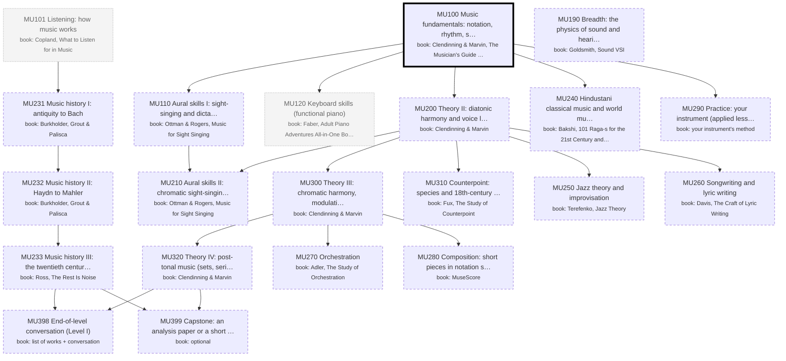

# Music: the major as a DAG of books

Generated by `scripts/major_dag.py` from `curriculum.json`; don't edit by hand. Each box is a course: a block of its
primary book ("book: …" lines). Arrows point from a prerequisite to the course that needs it. Bold = active,
grey = done, dashed = later or optional. Level II courses appear only once you enroll.

## Where you enter

Written as if starting from high school (MU100, MU101 first). Your entry point:
- **Credited** (pale grey, from your degrees): 
- **Maybe** (dotted: skim or skip, your call): MU101, MU120
- **Start here** (thick border): MU100
- Basis: You play guitar, used to play piano and read basic notation; no music courses on either transcript. MU100 is the start but runs as a fast pass (skip what you know; keys, intervals and triads are where it slows down). MU120 keyboard is 'maybe' (a refresher for a former pianist). MU101 listening is 'maybe'. Guitar is the instrument for MU290 practice.
