# Physics: the major as a DAG of books

Generated by `scripts/major_dag.py` from `curriculum.json`; don't edit by hand. Each box is a course: a block of its
primary book ("book: …" lines). Arrows point from a prerequisite to the course that needs it. Bold = active,
grey = done, dashed = later or optional. Level II courses appear only once you enroll.

```mermaid
flowchart TB
  MA100["MA100 Precalculus: algebra, functions, trigon…<br/><small>book: OpenStax, Precalculus 2e</small>"]
  MA140["MA140 Calculus I: limits, derivatives, integr…<br/><small>book: OpenStax, Calculus Volume 1</small>"]
  MA141["MA141 Calculus II: integration techniques, se…<br/><small>book: OpenStax, Calculus Volume 2</small>"]
  MA220["MA220 Matrices: computational linear algebra<br/><small>book: Strang, Introduction to Linear Algebra</small>"]
  MA230["MA230 Calculus of several variables and vecto…<br/><small>book: OpenStax, Calculus Volume 3</small>"]
  MA250["MA250 Ordinary differential equations<br/><small>book: Zill, Differential Equations with Boundary-…</small>"]
  PH211["PH211 Mechanics (calculus-based)<br/><small>book: OpenStax, University Physics Volume 1</small>"]
  PH212["PH212 Electricity and magnetism (calculus-bas…<br/><small>book: OpenStax, University Physics Volume 2</small>"]
  PH213["PH213 Fluids and thermal physics (intro)<br/><small>book: University Physics Vol. 1 ch. 14</small>"]
  PH214["PH214 Waves, optics and the first quantum ide…<br/><small>book: OpenStax, University Physics Volume 3</small>"]
  PH237["PH237 Modern physics: relativity, quanta, ato…<br/><small>book: Krane, Modern Physics 3rd</small>"]
  PH300["PH300 Mathematical methods for physics<br/><small>book: Boas, Mathematical Methods in the Physical …</small>"]
  PH341["PH341 Classical mechanics: oscillators, Lagra…<br/><small>book: Taylor, Classical Mechanics</small>"]
  PH351["PH351 Electromagnetism I: electrostatics, mag…<br/><small>book: Griffiths, Introduction to Electrodynamics …</small>"]
  PH352["PH352 Electromagnetism II: electrodynamics, w…<br/><small>book: Griffiths, Introduction to Electrodynamics …</small>"]
  PH361["PH361 Quantum mechanics I<br/><small>book: Griffiths & Schroeter, Introduction to Quan…</small>"]
  PH362["PH362 Quantum mechanics II: identical particl…<br/><small>book: Griffiths & Schroeter</small>"]
  PH371["PH371 Thermal and statistical physics<br/><small>book: Schroeder, An Introduction to Thermal Physi…</small>"]
  PH380["PH380 Computational physics<br/><small>book: Fitzpatrick, Computational Physics</small>"]
  PH391["PH391 Optics<br/><small>book: Hecht, Optics 5th</small>"]
  PH393["PH393 Nuclear and particle physics<br/><small>book: Griffiths, Introduction to Elementary Parti…</small>"]
  PH394["PH394 General relativity (undergraduate)<br/><small>book: Schutz, A First Course in General Relativit…</small>"]
  PH395["PH395 Solid state physics<br/><small>book: Simon, The Oxford Solid State Basics</small>"]
  PH396["PH396 Astrophysics<br/><small>book: Carroll & Ostlie, An Introduction to Modern…</small>"]
  MA412["MA412 Fourier series and partial differential…<br/><small>book: Strauss, Partial Differential Equations</small>"]
  PH190["PH190 Breadth: what physics is, how it got he…<br/><small>book: Perkowitz, Physics VSI</small>"]
  PH390["PH390 Practice: tabletop and phone-sensor exp…<br/><small>book: phyphox</small>"]
  PH398["PH398 End-of-level conversation (Level I)<br/><small>book: list of works + conversation</small>"]
  PH399["PH399 Capstone: senior thesis (reproduce a cl…<br/><small>book: optional</small>"]
  MA100 --> MA140
  MA140 --> MA141
  MA100 --> MA220
  MA141 --> MA230
  MA220 --> MA230
  MA141 --> MA250
  MA220 --> MA250
  MA140 --> PH211
  PH211 --> PH212
  MA141 --> PH212
  PH211 --> PH213
  MA141 --> PH213
  PH212 --> PH214
  PH214 --> PH237
  MA250 --> PH237
  MA230 --> PH300
  MA250 --> PH300
  MA220 --> PH300
  PH211 --> PH341
  PH300 --> PH341
  PH212 --> PH351
  PH300 --> PH351
  PH351 --> PH352
  PH237 --> PH361
  PH300 --> PH361
  PH361 --> PH362
  PH213 --> PH371
  PH237 --> PH371
  MA230 --> PH371
  PH341 --> PH380
  MA250 --> PH380
  PH352 --> PH391
  PH361 --> PH393
  PH352 --> PH394
  PH341 --> PH394
  PH361 --> PH395
  PH371 --> PH395
  PH237 --> PH396
  PH341 --> PH396
  MA250 --> MA412
  MA230 --> MA412
  PH211 --> PH390
  PH352 --> PH398
  PH362 --> PH398
  PH371 --> PH398
  PH341 --> PH399
  PH361 --> PH399
  classDef done fill:#eee,color:#777,stroke:#bbb
  classDef active stroke-width:3px
  classDef later stroke-dasharray:5 4
  classDef credited fill:#e8e8e8,color:#999,stroke:#ccc
  classDef maybe fill:#f4f4f4,color:#666,stroke:#aaa,stroke-dasharray:2 2
  classDef start stroke-width:4px,stroke:#000
  class MA100 credited
  class MA140 credited
  class MA141 credited
  class MA220 credited
  class MA230 credited
  class MA250 credited
  class PH211 credited
  class PH212 credited
  class PH213 credited
  class PH214 credited
  class PH237 credited
  class PH300 maybe
  class PH341 credited
  class PH351 credited
  class PH352 maybe
  class PH361 start
  class PH362 later
  class PH371 credited
  class PH380 later
  class PH391 later
  class PH393 later
  class PH394 later
  class PH395 later
  class PH396 later
  class MA412 maybe
  class PH190 later
  class PH390 later
  class PH398 later
  class PH399 later
```

## Where you enter

Written as if starting from high school (MA100 first). Your entry point:
- **Credited** (pale grey, from your degrees): MA100, MA140, MA141, MA220, MA230, MA250, PH211, PH212, PH213, PH214, PH237, PH341, PH351, PH371
- **Maybe** (dotted: skim or skip, your call): MA412, PH300, PH352
- **Start here** (thick border): PH361
- Basis: Penn State BS Computer Engineering requires PHYS 211 (mechanics), 212 (E&M) and 214 (waves and quantum); the math degree covers the calculus, linear algebra and ODE rows. PHYS 213 (fluids, thermal) was not required. Boas (PH300) becomes a look-up shelf rather than a course. You also took modern physics, classical mechanics, electrodynamics and thermal physics (physics department), so PH237, PH341, PH351 and PH371 are credited (PH213 with them); PH352 is 'maybe' in case your E&M course stopped before radiation and relativity.
