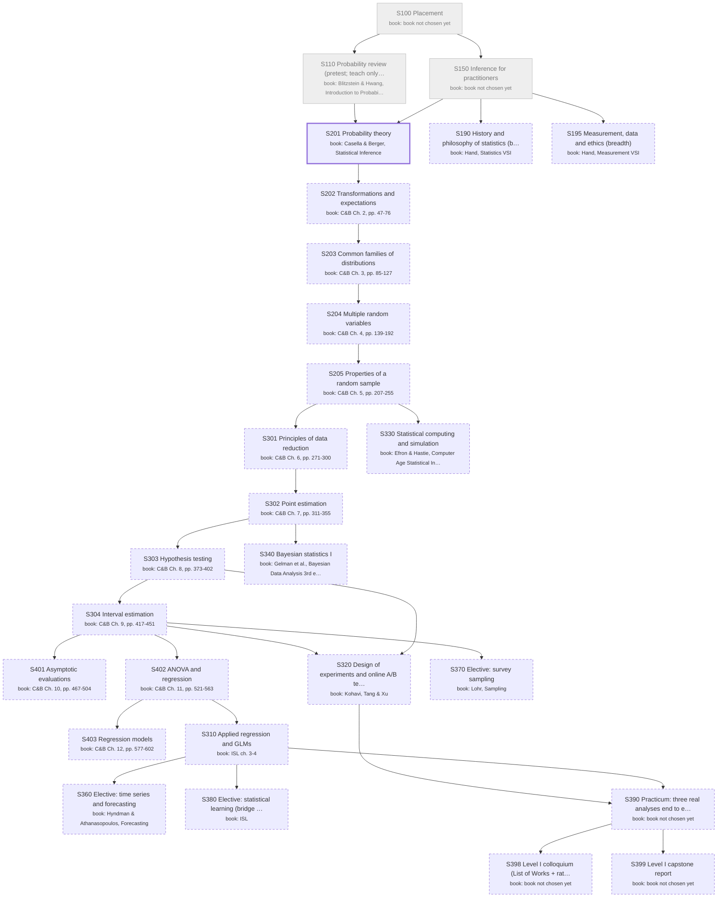

# Statistics: the major as a DAG of books

Generated by `scripts/major_dag.py` from `curriculum.json`; don't edit by hand. Each box is a course: a block of its
primary book ("book: …" lines). Arrows point from a prerequisite to the course that needs it. Bold = active,
grey = done, dashed = later or optional. Level II courses appear only once you enroll.

## Active courses: books by role

**S201 Probability theory**
- primary: f9dc4d1d4c Casella & Berger, Statistical Inference, Ch. 1 (sections, examples and exercises)
- secondary: 61590a65c1 Patrick, Intermediate Counting and Probability (AoPS): extra counting practice if §1.2.3-1.2.4 is a gap
- tertiary: a53c1f767c Haigh, Probability (VSI): intuition and history, optional
- skip: fa09582d3b Ross, A First Course in Probability: grade C (garbled text)
- skip: f58aa520f3 Jaynes, Probability Theory: philosophy of probability; save for the Bayesian course
