# Unified Engineering: the major as a DAG of books

Generated by `scripts/major_dag.py` from `curriculum.json`; don't edit by hand. Each box is a course: a block of its
primary book ("book: …" lines). Arrows point from a prerequisite to the course that needs it. Bold = active,
grey = done, dashed = later or optional. Level II courses appear only once you enroll.

```mermaid
flowchart TB
  subgraph T0["Base"]
    MA100["MA100 Precalculus: algebra, functions, trigon…<br/><small>book: OpenStax, Precalculus 2e</small>"]
    MA140["MA140 Calculus I: limits, derivatives, integr…<br/><small>book: OpenStax, Calculus Volume 1</small>"]
    MA141["MA141 Calculus II: integration techniques, se…<br/><small>book: OpenStax, Calculus Volume 2</small>"]
    MA220["MA220 Matrices: computational linear algebra<br/><small>book: Strang, Introduction to Linear Algebra</small>"]
    MA230["MA230 Calculus of several variables and vecto…<br/><small>book: OpenStax, Calculus Volume 3</small>"]
    MA250["MA250 Ordinary differential equations<br/><small>book: Zill, Differential Equations with Boundary-…</small>"]
    MA414["MA414 Probability<br/><small>book: Bertsekas & Tsitsiklis, Introduction to Pro…</small>"]
    PH211["PH211 Mechanics (calculus-based)<br/><small>book: OpenStax, University Physics Volume 1</small>"]
    PH212["PH212 Electricity and magnetism (calculus-bas…<br/><small>book: OpenStax, University Physics Volume 2</small>"]
    CH110["CH110 Chemical principles for engineers<br/><small>book: OpenStax, Chemistry 2e</small>"]
    ES150["ES150 Engineering graphics and CAD (sketching…<br/><small>book: Gohde & Kintel, Programming with OpenSCAD</small>"]
    ES160["ES160 Programming and numerical methods for e…<br/><small>book: Hoffman, Numerical Methods for Engineers an…</small>"]
  end
  subgraph T1["Unified I"]
    ES211["ES211 Statics<br/><small>book: Baker & Haynes, Engineering Statics</small>"]
    ES240["ES240 Materials science and engineering<br/><small>book: Callister & Rethwisch, Materials Science an…</small>"]
    ES250["ES250 Circuits and electronics for engineers<br/><small>book: Kuphaldt, Lessons in Electric Circuits vols…</small>"]
    ES221["ES221 Thermodynamics<br/><small>book: Cengel, Introduction to Thermodynamics and …</small>"]
  end
  subgraph T2["Unified II"]
    ES212["ES212 Dynamics<br/><small>book: Hibbeler, Engineering Mechanics</small>"]
    ES213["ES213 Mechanics of materials: stress, strain,…<br/><small>book: Hibbeler, Mechanics of Materials 10th</small>"]
    ES231["ES231 Fluid mechanics<br/><small>book: Cengel & Cimbala, Fluid Mechanics</small>"]
    UE202["UE202 Signals and systems<br/><small>book: Oppenheim, Willsky & Nawab</small>"]
  end
  subgraph T3["Unified III"]
    ES340["ES340 System dynamics and feedback control<br/><small>book: Astrom & Murray, Feedback Systems 2nd</small>"]
    ES370["ES370 Heat transfer<br/><small>book: Cengel, Introduction to Thermodynamics and …</small>"]
    UE204["UE204 Chemical process principles: material a…<br/><small>book: Felder, Rousseau & Bullard</small>"]
    UE309["UE309 Applied electromagnetics: transmission …<br/><small>book: Ulaby & Ravaioli, Fundamentals of Applied E…</small>"]
  end
  subgraph T4["Discipline tour"]
    UE310["UE310 Civil and structural engineering: how s…<br/><small>book: Gordon, Structures</small>"]
    UE320["UE320 Environmental and water engineering<br/><small>book: Davis & Cornwell, Introduction to Environme…</small>"]
    UE330["UE330 Electronics and embedded systems<br/><small>book: Horowitz & Hill, The Art of Electronics 3rd</small>"]
    UE335["UE335 Digital systems and computer organizati…<br/><small>book: Harris & Harris, Digital Design and Compute…</small>"]
    UE340["UE340 Aerospace engineering: flight, aerodyna…<br/><small>book: Anderson, Introduction to Flight</small>"]
    UE350["UE350 Nuclear engineering<br/><small>book: Lamarsh & Baratta, Introduction to Nuclear …</small>"]
    UE360["UE360 Biomedical engineering: biomechanics an…<br/><small>book: Knudson, Fundamentals of Biomechanics 2nd</small>"]
    UE370["UE370 Industrial and systems engineering: ope…<br/><small>book: Hillier & Lieberman, Introduction to Operat…</small>"]
    ME360["ME360 Manufacturing processes (machining, cas…<br/><small>book: Kalpakjian & Schmid, Manufacturing Engineer…</small>"]
  end
  subgraph T5["Integration"]
    UE400["UE400 Systems engineering and integrated desi…<br/><small>book: NASA Systems Engineering Handbook, SP-2016-…</small>"]
  end
  ME310["ME310 Kinematics and dynamics of machinery (l…<br/><small>book: Norton, Design of Machinery</small>"]
  ME330["ME330 Mechanical vibrations<br/><small>book: Rao, Mechanical Vibrations</small>"]
  ME350["ME350 Machine design (failure theories, fatig…<br/><small>book: Budynas & Nisbett, Shigley's Mechanical Eng…</small>"]
  ME410["ME410 Finite element analysis<br/><small>book: Logan, A First Course in the Finite Element…</small>"]
  ME430["ME430 Robotics<br/><small>book: Lynch & Park, Modern Robotics</small>"]
  MA412["MA412 Fourier series and partial differential…<br/><small>book: Strauss, Partial Differential Equations</small>"]
  UE190["UE190 Breadth: what engineering is (all the d…<br/><small>book: Blockley, Engineering VSI</small>"]
  UE195["UE195 Breadth: engineering economics and ethi…<br/><small>book: Newnan et al., Engineering Economic Analysis</small>"]
  ES380["ES380 Practice: measurement and instrumentati…<br/><small>book: Horowitz & Hill</small>"]
  UE395["UE395 Practice: FE exam (Other Disciplines) s…<br/><small>book: NCEES FE Reference Handbook</small>"]
  ME385["ME385 Practice: shop work (woodworking and ma…<br/><small>book: Wearing, The Essential Woodworker</small>"]
  UE398["UE398 End-of-level conversation (Level I)<br/><small>book: list of works + conversation</small>"]
  UE399["UE399 Capstone: a multidisciplinary design-bu…<br/><small>book: optional; to choose with you</small>"]
  MA100 --> MA140
  MA140 --> MA141
  MA100 --> MA220
  MA141 --> MA230
  MA220 --> MA230
  MA141 --> MA250
  MA220 --> MA250
  MA230 --> MA414
  MA140 --> PH211
  PH211 --> PH212
  MA141 --> PH212
  MA100 --> CH110
  MA100 --> ES150
  MA141 --> ES160
  MA220 --> ES160
  PH211 --> ES211
  MA141 --> ES211
  CH110 --> ES240
  PH211 --> ES240
  PH212 --> ES250
  MA250 --> ES250
  PH211 --> ES221
  CH110 --> ES221
  MA141 --> ES221
  ES211 --> ES212
  MA230 --> ES212
  ES211 --> ES213
  MA250 --> ES213
  ES212 --> ES231
  ES221 --> ES231
  MA230 --> ES231
  ES250 --> UE202
  MA250 --> UE202
  ES212 --> ES340
  ES250 --> ES340
  MA250 --> ES340
  ES221 --> ES370
  ES231 --> ES370
  CH110 --> UE204
  ES221 --> UE204
  PH212 --> UE309
  MA230 --> UE309
  ES213 --> UE310
  UE204 --> UE320
  ES231 --> UE320
  ES250 --> UE330
  UE202 --> UE330
  ES250 --> UE335
  ES231 --> UE340
  ES221 --> UE340
  ES212 --> UE340
  PH212 --> UE350
  ES221 --> UE350
  MA250 --> UE350
  ES212 --> UE360
  ES213 --> UE360
  MA414 --> UE370
  MA220 --> UE370
  ES240 --> ME360
  ES150 --> ME360
  ES340 --> UE400
  UE310 --> UE400
  UE330 --> UE400
  UE340 --> UE400
  ES212 --> ME310
  ES150 --> ME310
  ES212 --> ME330
  MA250 --> ME330
  MA220 --> ME330
  ES213 --> ME350
  ES240 --> ME350
  ME310 --> ME350
  ES213 --> ME410
  ES160 --> ME410
  ES212 --> ME430
  ES340 --> ME430
  MA220 --> ME430
  MA250 --> MA412
  MA230 --> MA412
  MA141 --> UE195
  ES250 --> ES380
  MA414 --> ES380
  ES231 --> UE395
  ES213 --> UE395
  ES340 --> UE395
  ES150 --> ME385
  UE400 --> UE398
  UE400 --> UE399
  classDef done fill:#eee,color:#777,stroke:#bbb
  classDef active stroke-width:3px
  classDef later stroke-dasharray:5 4
  classDef credited fill:#e8e8e8,color:#999,stroke:#ccc
  classDef maybe fill:#f4f4f4,color:#666,stroke:#aaa,stroke-dasharray:2 2
  classDef start stroke-width:4px,stroke:#000
  class MA100 credited
  class MA140 credited
  class MA141 credited
  class MA220 credited
  class MA230 credited
  class MA250 credited
  class MA414 credited
  class PH211 credited
  class PH212 credited
  class CH110 credited
  class ES150 start
  class ES160 maybe
  class ES211 start
  class ES240 start
  class ES250 credited
  class ES221 start
  class ES212 later
  class ES213 later
  class ES231 later
  class UE202 credited
  class ES340 later
  class ES370 later
  class UE204 later
  class UE309 later
  class UE310 later
  class UE320 later
  class UE330 maybe
  class UE335 credited
  class UE340 later
  class UE350 later
  class UE360 later
  class UE370 later
  class ME360 later
  class UE400 later
  class ME310 later
  class ME330 later
  class ME350 later
  class ME410 later
  class ME430 later
  class MA412 later
  class UE190 later
  class UE195 later
  class ES380 later
  class UE395 later
  class ME385 later
  class UE398 later
  class UE399 later
```

## Where you enter

Written as if starting from high school (MA100 first). Your entry point:
- **Credited** (pale grey, from your degrees): CH110, ES250, MA100, MA140, MA141, MA220, MA230, MA250, MA414, PH211, PH212, UE202, UE335
- **Maybe** (dotted: skim or skip, your call): ES160, UE330
- **Start here** (thick border): ES211, ES240, ES221, ES150
- Basis: Penn State BS Computer Engineering: the math and physics base, CHEM 110, EE 210 (circuits), EE 353 (signals and systems), CMPEN 270/331 and CMPSC 311/473-level systems courses (digital systems), EE 310 (electronic circuit design; the embedded half may be new). So Unified I runs three of its four courses for you.
